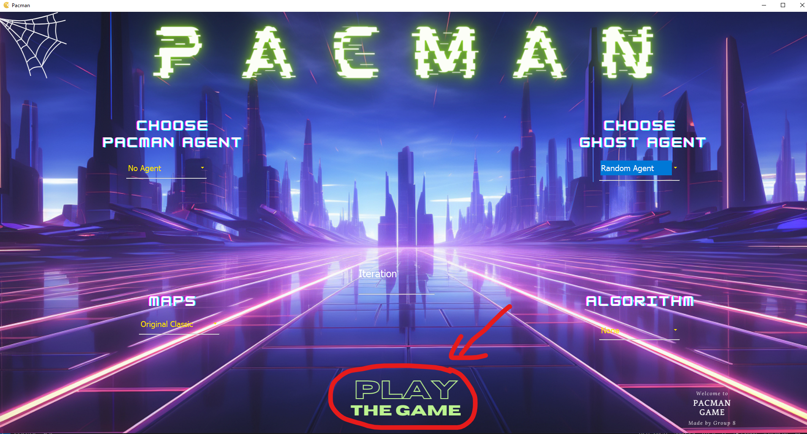
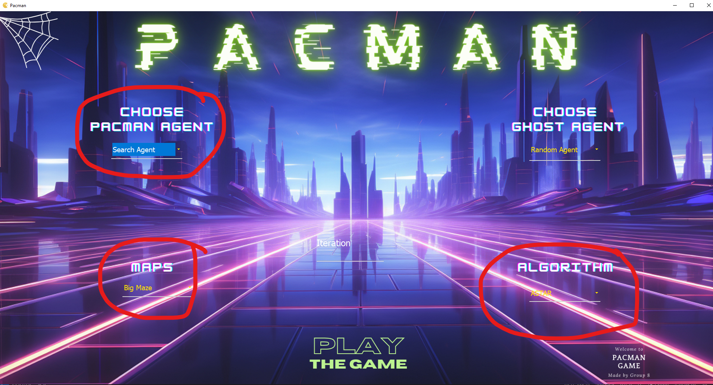
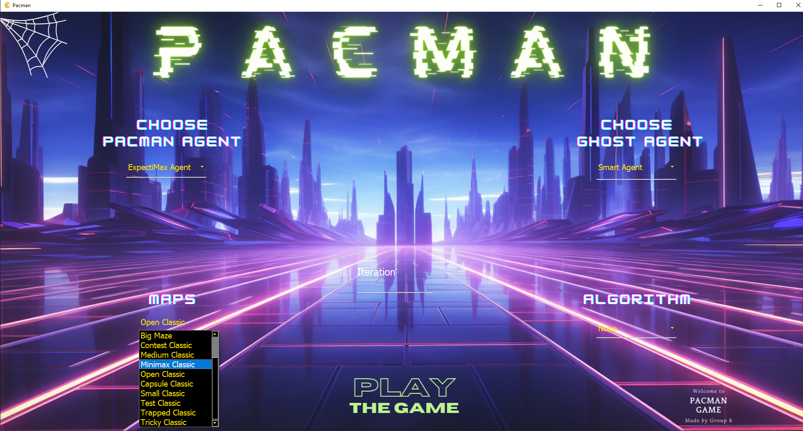
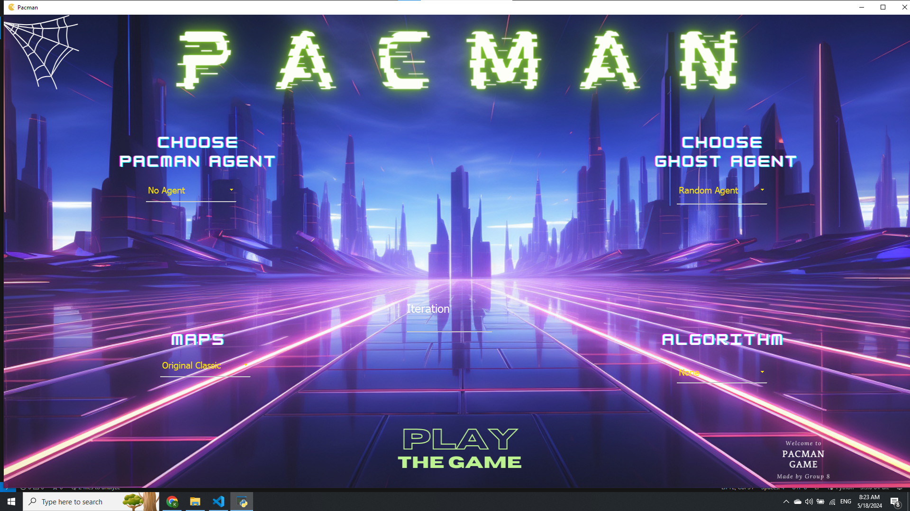
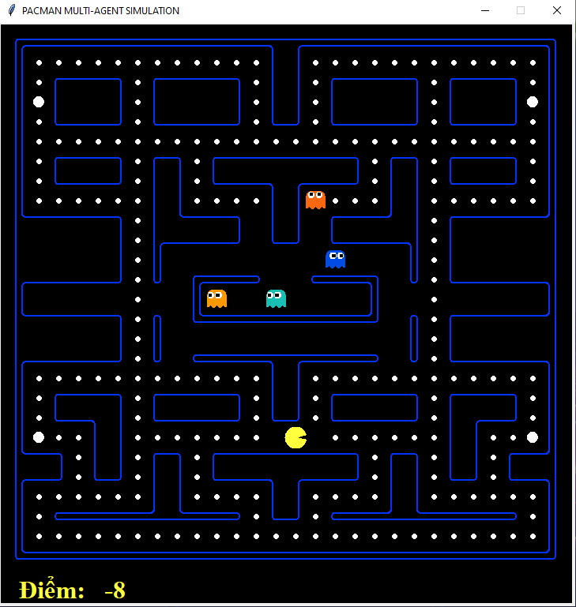
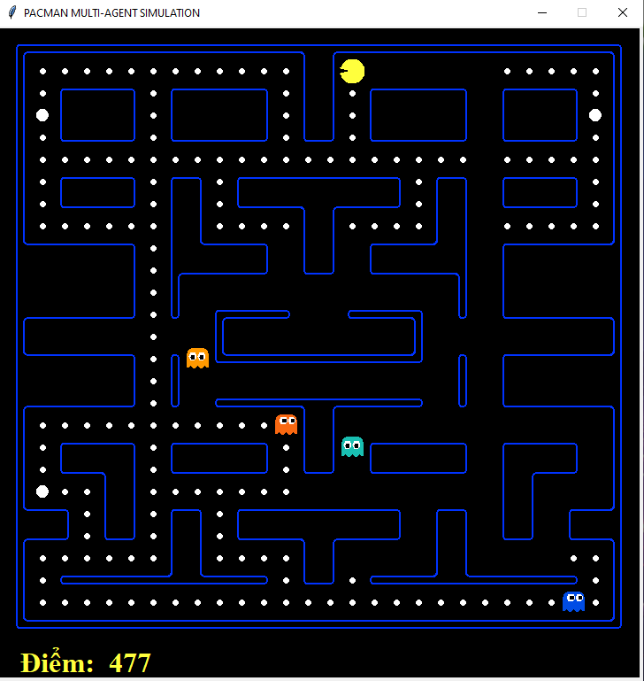
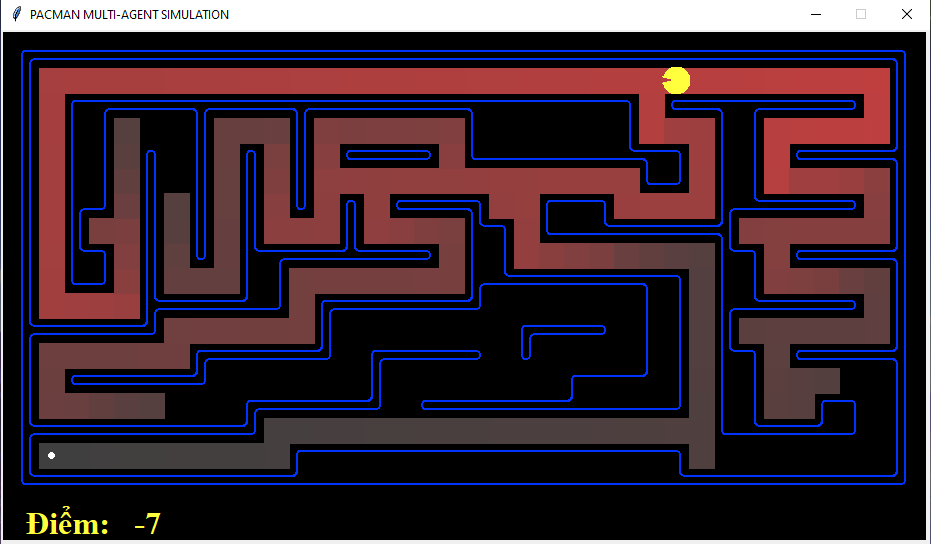
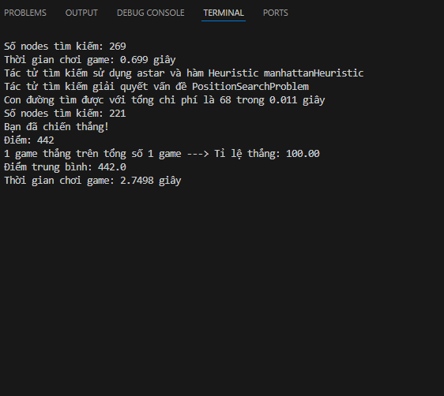

# Pacman AI in python


Đây là một sự minh họa dễ hiểu cho các thuật toán tìm kiếm đơn giản.

## Cài đặt môi trường
Chúng tôi sử dụng python phiên bản 3.9.6
Để chạy chương trình, ta cần cài đặt các thư viện cần thiết bằng câu lệnh đơn giản sau:
```
pip install -r requirements.txt
```

## Tính năng

1. Giao diện GUI
2. Trò chơi pacman thông thường
3. Minh họa các thuật toán tìm kiếm DFS, BFS, UCS, A*
4. Minh họa các thuật toán tìm kiếm khi có đối thủ Reflex, Minimax, Alpha-beta prunning, Expectimax
5. Tác tử ma ngẫu nhiên và ma thông minh
6. 3 Map thiết kế cho thuật toán tìm kiếm trong mê cung và 10 map thiết kế cho thuật toán tìm kiếm đối nghịch
7. Chạy vòng lặp đo kết quả

## Hướng dẫn sử dụng
1. Sau khi cài đặt thư viện xong, ta vào folder 'src', sau đó chạy file 'pacmanGUI.py' để khởi động chương trình:
```
python pacmanGUI.py
```
2. Để chơi pacman thông thường, ta ấn thẳng nút **Play** mà không cần lựa chọn gì cả.
  
3. Để chạy những thuật toán DFS, BFS, ASTAR, UCS, ta cần lựa chọn tác tử pacman là `Search Agent`, chọn 1 trong 3 map Tiny Maze, Medium Maze, Big Maze, và chọn 1 trong 4 thuật toán, tác tử ma không lựa chọn
  
4. Để chạy các thuật toán tìm kiếm khi có đối thủ Reflex, Minimax, Alpha-beta prunning, Expectimax, ta lựa chọn các tác tử pacman, tác tử ma, các map còn lại trừ 3 map trên và thuật toán để **None**
   
## Images

  
  
  
  
  

## Đánh giá
Tôi tạo ra giao diện này chỉ để minh họa trực quan cho những thuật toán học trên lớp cho nên có thể thuật toán không phải tốt nhất, độ phức tạp chưa cao. Mọi người có thể tham khảo vào source code, phát triển thuật toán để ứng dụng này trở nên tốt hơn. Thanks!
  


